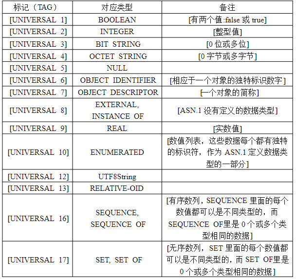
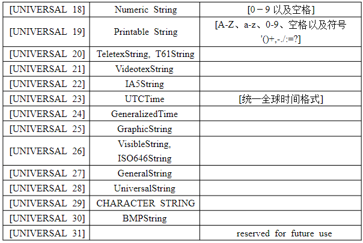
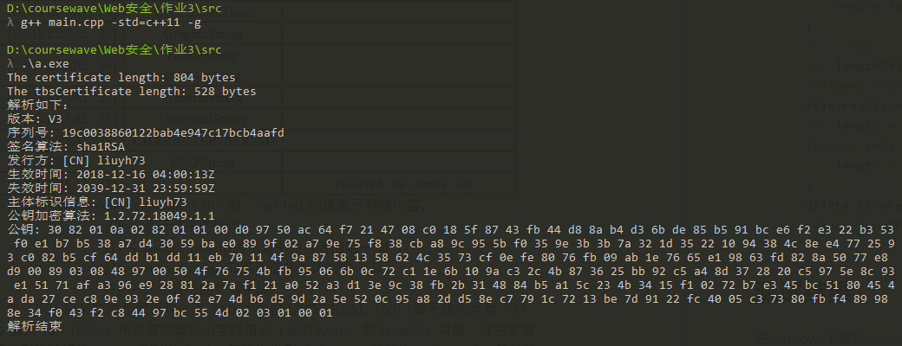

# X.509证书解析

## X.509证书结构

- 版本号：表示证书的版本：v1，v2，v3

- 序列号：表示证书的唯一整数，有证书发布者分配的本证书的唯一标识符

- 签名算法：用于前证书的算法表示，有对象标识符加上相关的参数组成，用于说明本证书所用的签名算法。例如：SHA-1、RSA等。

- 发布者：证书发布者的可识别名。

- 有效期：证书有效期的时间段。本字段由Not Before和NotAfter两项组成。它们分别由UTC时间或一般的事件表示。

- 主体：证书拥有者的可识别名，这个字段必须非空，除非证书扩展中有别名

- 主题公钥信息：主题公钥

- 扩展部分：

  - 发布者密钥标识符

    证书所含密钥的唯一标识符,用来区分同一证书拥有者的多对密钥

  - 密钥使用

    一个比特串,指明(限定)证书的公钥可以完成的功能或服务,如:证书签名、数据加密等

  - CRL分布点

    指明CRL分布地点

  - 私钥使用期

    指明证书中与公钥相联系的私钥的使用期限,它也有Not Before和Not Aft

  - 证书策略

    由对象标识符和限定符组成，这些对象标识符说明证书的颁发和使用策略有关

  - 策略映射

    表明两个CA域之间的一个或多个策略对象标识符的等价关系,仅在CA证书里存在

  - 主体别名

    指出证书拥有者的别名,如电子邮件地址、IP地址等,别名是和DN绑定在一起的

  - 发布者别名

    指出证书颁发者的别名,如电子邮件地址、IP地址等,但颁发者的DN必须出现在证

  - 主题目录属性

    指出证书拥有者的一系列属性。可以使用这一项来传递访问控制信息。

## X.509证书编码

X.509证书的结构是用ASN1(Abstract Syntax Notation One)进行描述数据结构，并使用ASN1语法进行编码。

用ASN.1语法描述如下：

```
Certificate::=SEQUENCE{
    tbsCertificate      TBSCertificate,
    signatureAlgorithm  AlgorithmIdentifier,
    signatureValue      BIT STRING
}
```

其中，签名算法为CA对`tbsCertificate`进行签名所使用的算法；类型为`Algorithm Identifier`，其ASN.1语法描述如下：

```
AlgorithmIdentifier::=SEQUENCE{
    algorithm       OBJECT IDENTIFIER,
    parameters      ANY DEFINED BY algorithm OPTIONAL
}
```

证书内容是需要被CA签名的信息，ASN.1语法描述如下：

```
TBSCertificate::=SEQUENCE{
    version           [0]   EXPLICIT Version DEFAULT v1,
    serialNumber            CertificateSerialNumber,
    signature               AlgorithmIdentifier,
    issuer                  Name,
    validity                Validity,
    subject                 Name,
    subjectPublicKeyInfo    SubjectPublicKeyInfo,
    issuerUniqueID    [1]   IMPLICIT UniqueIdentifier OPTIONAL,
    subjectUniqueID   [2]   IMPLICIT UniqueIdentifier OPTIONAL,
    extensions        [3]   EXPLICIT Extensions OPTIONAL
}
```

其中，`issuerUniqueID`和`subjectUniqueID`只能在版本2或者3中出现；`extensions`只能在版本3中出现.

ASN1采用一个个的数据块来描述整个数据结构,每个数据块都有四个部分组成:

**1. 数据类型标识（一个字节）**

简单类型是不能再分解类型,如整型(INTERGER)、比特串(BIT STRING)、字节串(OCTET STRING)、对象标示符(OBJECT IDENTIFIER)、日期型(UTCTime)等；

结构类型是由简单类型和结构类型组合而成的,如顺序类型(SEQUENCE, SEQUENCE OF）、选择类型（CHOICE）、集合类型等。

- 顺序类型的数据块值由按给定顺序成员成员数据块值按照顺序组成；
- 选择类型的数据块值由多个成员数据数据块类型中选择一个的数据块值；
- 集合数据块类型由成员数据块类型的一个或多个值构成。





**2. 数据块长度（1-128个字节）**

- 若长度小于等于127，则用一个字节表示；
- 若长度大于127，则用多个字节表示。第一个字节最高为1，其余7位给出实际字节长度，从第二个字节开始存放长度信息；
- 若长度等于128，则标识数据块长度补丁，需要数据块结束标识结束数据块。

**3. 数据块的值**

具体编码随数据块类型不同而不同。

**4. 数据块结束标识（可选）**

结束标示字段,两个字节(0x0000),只有在长度值为不定时才会出现。

## 代码数据结构

```c
// info中包含信息长度以及信息内容的指针，ismallc用于程序结束前释放内容的标识
struct info {
    bool ismallc;
    int length;
    unsigned char* data;
};
// 存放解析后的信息
vector<info>certInfo;
```

解释处理数据块长度的函数：

```c
// 此函数处理 数据块长度（1-128个字节）（len即为从证书中读取的长度）
int getLength(ifstream& file, int len) {
    // < 128
    if (len <= 0x7F) {
        return len;
    }
    //  > 128
    int lengthOflen = len ^ 0x80;
    unsigned char* bytes = new unsigned char[lengthOflen];
    file.read((char*)bytes, lengthOflen);
    int length = 0;
    for(int i=0; i<lengthOflen; i++){
        length = (length << 8) + int(bytes[i]);
    }
    delete []bytes;
    return length;
}
```

## 测试结果

在windows下使用makecert命令生成证书：

```bash
> makecert.exe -r -pe -$ individual -n "CN=liuyh73" -sky exchange -sr currentuser -ss my liuyh73.crt
```

编译运行结果：



【注意】打开源代码时注意使用gb2312编码格式，否则会造成乱码。